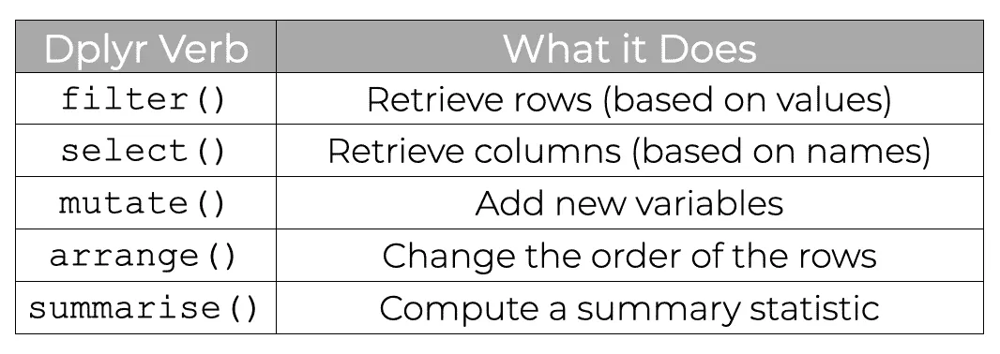

# Data Preparation

```{r 01-01, include=FALSE}

data(Salaries, package="carData")

```


**Learning objectives:**

- How to import data from external sources, such as text files, excel spreadsheets, statistical packages, and databases

- How to clean data so that its in a useful format prior to visualizing it

## Importing data

- We'll use the [Salaries](https://rkabacoff.github.io/datavis/Data.html#Salaries) dataset to illustrate that R can import data from many different sources.

- It is provided in other formats (i.e. `.csv`, `.txt`, `.xsls`) in [Appendix A](https://rkabacoff.github.io/datavis/Data.html) of the book so that you can practice importing data.

- The dataset describes the 9 month academic salaries of 397 college professors at a single institution in 2008-2009. 

## Text files

The [`readr`](https://www.rdocumentation.org/packages/readr/versions/0.1.1/topics/read_delim) package provides functions for importing delimited text files into R data frames.

```{r 01-02, eval=FALSE}
library(readr)

# import data from a comma delimited file
Salaries <- read_csv("data/salaries.csv")

# import data from a tab delimited file
Salaries <- read_tsv("data/salaries.txt")
```


## Excel spreadsheets

The [`readxl`](https://www.rdocumentation.org/packages/readxl/versions/1.4.2) package can import data from Excel workbooks. Both xls and xlsx formats are supported. 

Since workbooks can have more than one worksheet, you can specify the one you want with the `sheet` option. The default is `sheet=1`.

```{r 01-03, eval=FALSE}
library(readxl)

# import data from an Excel workbook
Salaries <- read_excel("data/salaries.xlsx", sheet=1)
```


## Stastistical packages

The [`haven`](https://www.rdocumentation.org/packages/haven/versions/2.5.2) package provides functions for importing data from a variety of statistical packages.


```{r 01-04, eval=FALSE}
library(haven)

# import data from Stata
Salaries <- read_dta("data/salaries.dta")

# import data from SPSS
Salaries <- read_sav("data/salaries.sav")

# import data from SAS
Salaries <- read_sas("data/salaries.sas7bdat")
```


## Databases

Depending on the database containing the data, the following packages can help: 

- [`RODBC`](https://www.rdocumentation.org/packages/RODBC/versions/0.8-3/topics/RODBC) 
- [`RMySQL`](https://www.rdocumentation.org/packages/RMySQL/versions/0.10.25) 
- [`ROracle`](https://www.rdocumentation.org/packages/ROracle/versions/1.3-1.1)
- [`RPostgreSQL`](https://www.rdocumentation.org/packages/RPostgreSQL/versions/0.7-5) 
- [`RSQLite`](https://www.rdocumentation.org/packages/RSQLite/versions/2.3.0)
- [`RMongo`](https://www.rdocumentation.org/packages/RMongo/versions/0.0.25)

In the newest versions of RStudio, you can use the *Connections pane* to quickly access the data stored in database management systems.

## Cleaning data

- Cleaning data can be the most time consuming part of any data analysis.

- Two of the quickest and easiest to learn approaches to clean data are using the [`dplyr`](https://dplyr.tidyverse.org/) and [`tidyr`](https://tidyr.tidyverse.org/) package.


```{r 01-05, echo=FALSE}

```

## Selecting variables

The `dplyr::select` function allows you to limit your dataset to specified variables (columns).

```{r 01-06, eval=FALSE}
library(dplyr)
data("starwars")

# keep the variables name, height, and gender
newdata <- select(starwars, name, height, gender)

# keep the variables name and all variables 
# between mass and species inclusive
newdata <- select(starwars, name, mass:species)

# keep all variables except birth_year and gender
newdata <- select(starwars, -birth_year, -gender)
```

## Selecting observations

The `dplyr::filter` function allows you to limit your dataset to observations (rows) meeting a specific criteria. Multiple criteria can be combined with the `&` (AND) and `|` (OR) symbols.

```{r 01-07, message=FALSE, warning=FALSE}
library(dplyr)
data("starwars")

# select females
newdata <- filter(starwars, 
                  gender == "feminine")

# select females that are from Alderaan
newdata <- filter(starwars, 
                  gender == "feminine" & 
                  homeworld == "Alderaan")
```


## Creating/Recoding variables

The `dplyr::mutate` function allows you to create new variables or transform existing ones.

```{r 01-08}
library(dplyr)
data("starwars") 

# convert height in centimeters to inches, 
# and mass in kilograms to pounds
newdata <- mutate(starwars, 
                  height = height * 0.394,
                  mass   = mass   * 2.205)
```

## 

The `ifelse` function (part of base R) can be used for recoding data. The format is `ifelse(test, return if TRUE, return if FALSE)`.

```{r 01-09}
# if height is greater than 180 
# then heightcat = "tall", 
# otherwise heightcat = "short"
newdata <- mutate(starwars, 
                  heightcat = ifelse(height > 180, 
                                     "tall", 
                                     "short"))

# set heights greater than 200 or less than 75 to missing
newdata <- mutate(starwars, 
                  height = ifelse(height < 75 | height > 200,
                                     NA, height))
```


## Summarizing data

The `dplyr::summarize` function can be used to reduce multiple values down to a single value (such as a mean). 


```{r 01-10}
library(dplyr)
# calculate mean height and mass
newdata <- summarize(starwars, 
                     mean_ht = mean(height, na.rm=TRUE), 
                     mean_mass = mean(mass, na.rm=TRUE))
newdata
```
##


The `dplyr::summarize` is often used in conjunction with the `group_by` function, to calculate statistics by group. 

```{r 01-12}
# calculate mean height and weight by gender
newdata <- group_by(starwars, gender)
newdata <- summarize(newdata, 
                     mean_ht = mean(height, na.rm=TRUE), 
                     mean_wt = mean(mass, na.rm=TRUE))
newdata
```


## Using pipes

- Tidyverse packages like `dplyr` and `tidyr` allow you to write code using the pipe ` %>% ` operator.

- The ` %>% ` operator passes the result on the left to the first parameter of the function on the right.


```{r 01-13}
library(dplyr)

# calculate the mean height for women by species
newdata <- starwars %>%
  filter(gender == "feminine") %>%
  group_by(species) %>%
  summarize(mean_ht = mean(height, na.rm = TRUE))

newdata
```


## Reshaping data

**NOTE:** tidyr 1.0.0 introduced `pivot_longer()` and `pivot_wider()`, replacing the older `spread()` and `gather()` functions. 

```{r 01-14}
library(tidyr)

table1 #tidy dataset
```

## `pivot_wider()`


```{r 01-15}
glimpse(table2)

table2 %>%
  pivot_wider(names_from = type, values_from = count)
```


## `pivot_longer()`


```{r 01-16}
glimpse(table4a)

table4a %>%
  pivot_longer(c(`1999`, `2000`), names_to = "year", values_to = "cases")
```


## Missing Data

There are three basic approaches to dealing with missing data: *feature selection*, *listwise deletion*, and *imputation*.

- In **feature selection**, you delete variables (columns) that contain too many missing values.

- **Listwise deletion** involves deleting observations (rows) that contain missing values on any of the variables of interest.

- **Imputation** involves replacing missing values with “reasonable” guesses about what the values would have been if they had not been missing. There are several approaches, as detailed in such packages as `VIM`, `mice`, `Amelia` and `missForest`.

## Resources

- [Dplyr Cheatsheet](https://github.com/rstudio/cheatsheets/blob/main/data-transformation.pdf)

- [Tidyr Cheatsheet](https://github.com/rstudio/cheatsheets/blob/main/tidyr.pdf)


## Meeting Videos {-}

### Cohort 1 {-}

`r knitr::include_url("https://www.youtube.com/embed/URL")`

<details>
<summary> Meeting chat log </summary>

```
LOG
```
</details>
