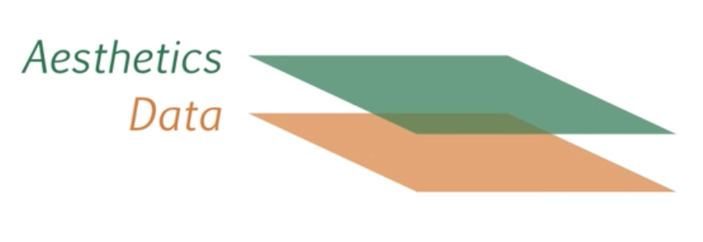
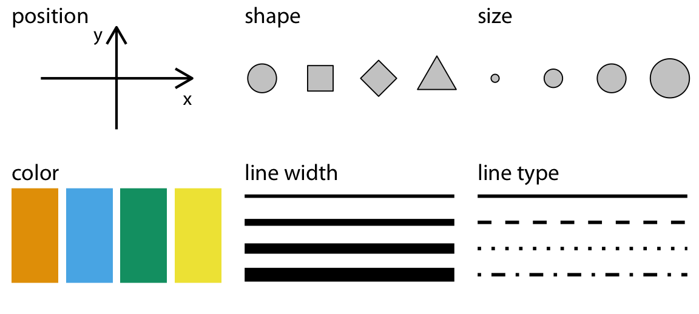
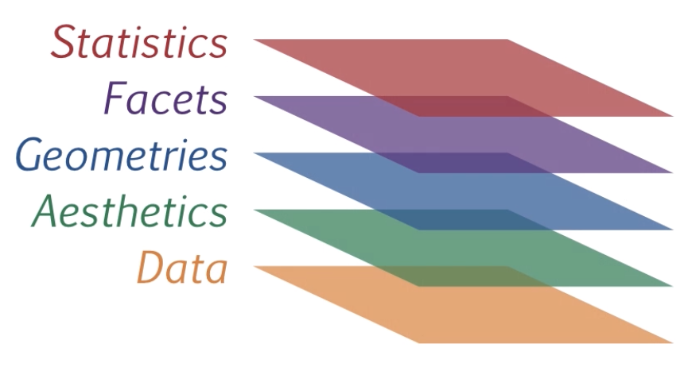
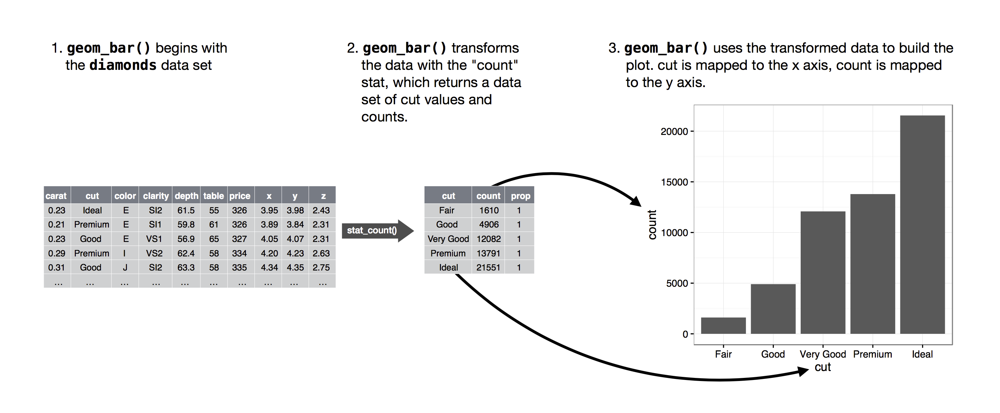

# Introduction to ggplot2

**Learning objectives:**

- We are going to learn about the layerd grammer of graphics on the {ggplot2} package in R

- We are going to learn about the key components of every graphics


## Introduction

```{r,echo=FALSE,warning=FALSE,message=FALSE}
library(png)
library(grid)
library(gridExtra)
img1 <- rasterGrob(as.raster(readPNG("images/grammar-of-graphics.png")),interpolate = FALSE)

img2 <- rasterGrob(as.raster(readPNG("images/ggplot2_logo.png")),interpolate = FALSE)


grid.arrange(img1,img2,ncol=2)
```

Leland Wilkinson (Grammar of Graphics, 1999) formalized two main principles in his plotting framework:

- Graphics = distinct layers of grammatical elements

- Meaningful plots through aesthetic mappings


- The essential grammatical elements to create any visualization with {ggplot2} are:


## Data layer


```{r,warning=FALSE,message=FALSE}
# load data
data(CPS85 , package = "mosaicData")
```

The Data Layer specifies the data being plotted.


```{r}
head(CPS85,n=3)

ggplot2::ggplot(data = CPS85)
```

## Aesthetic Layer

- This involves linking variables in the data to graphical properties of the plot (e.g.,**x**,**y**,**color**,**shape**,**size**).






```{r,warning=FALSE,message=FALSE}
# specify dataset and mapping

library(ggplot2)

ggplot(data = CPS85,
       mapping = aes(x = exper, y = wage))
```

## Geometries Layer

The next essential element for data visualization is the geometries layer or geom layer for short.


- Geoms are the geometric objects (**points**, **lines**, **bars**, etc.) that can be placed on a graph. 


```{r,warning=FALSE,message=FALSE}
# add points
ggplot(data = CPS85,
       mapping = aes(x = exper, y = wage)) +
  geom_point()
```

```{r,warning=FALSE,message=FALSE}
# delete outlier
library(dplyr)
plotdata <- filter(CPS85, wage < 40)

# redraw scatterplot
ggplot(data = plotdata,
       mapping = aes(x = exper, y = wage)) +
  geom_point()
```


```{r,warning=FALSE,message=FALSE}
# make points blue, larger, and semi-transparent
ggplot(data = plotdata,
       mapping = aes(x = exper, y = wage)) +
  geom_point(color = "cornflowerblue",
             alpha = .7,
             size = 3)
```

```{r,warning=FALSE,message=FALSE}
# add a line of best fit.
ggplot(data = plotdata,
       mapping = aes(x = exper, y = wage)) +
  geom_point(color = "cornflowerblue",
             alpha = .7,
             size = 3) +
  geom_smooth(method = "lm")
```

## Statistics Layer

- The statistics layer allows us to plot statistical values calculated from the data

- This is used to transform the input variables to displayed values



```{r,warning=FALSE,message=FALSE}
# indicate sex using color
ggplot(data = plotdata,
       mapping = aes(x = exper, 
                     y = wage,
                     color = sex)) +
  geom_point(alpha = .7,
             size = 3) +
  geom_smooth(method = "lm", 
              se = FALSE, 
              size = 1.5)
```




## Coordinates Layer

The coordinate layer allows us to adjust the x and y coordinates


- We can adjust the min and max values, as well as the major ticks. 

```{r}
ggplot(data = plotdata,
       mapping = aes(x = exper, 
                     y = wage,
                     color = sex)) +
  geom_point(alpha = .6) +
  geom_smooth(method = "lm", 
              se = FALSE)+
  coord_cartesian(xlim = c(0,60),ylim = c(0,30))

```


## grouping

In addition to mapping variables to the x and y axes, variables can be mapped to the **color**, **shape**, **size**, **transparency**, and other visual characteristics of geometric objects. 

- This allows groups of observations to be superimposed in a single graph.

- Let’s add sex to the plot and represent it by color.

```{r,warning=FALSE,message=FALSE}
# indicate sex using color
ggplot(data = plotdata,
       mapping = aes(x = exper, 
                     y = wage,
                     color = sex)) +
  geom_point(alpha = .7,
             size = 3) +
  geom_smooth(method = "lm", 
              se = FALSE, 
              size = 1.5)
```


- It appears that men tend to make more money than women. Additionally, there may be a stronger relationship between experience and wages for men than than for women.

## scales

- Scales control how variables are mapped to the visual characteristics of the plot. 

- Scale functions (which start with scale_) allow us to modify this mapping. 


```{r,warning=FALSE,message=FALSE}
# modify the x and y axes and specify the colors to be used
ggplot(data = plotdata,
       mapping = aes(x = exper, 
                     y = wage,
                     color = sex)) +
  geom_point(alpha = .7,
             size = 3) +
  geom_smooth(method = "lm", 
              se = FALSE, 
              size = 1.5) +
  scale_x_continuous(breaks = seq(0, 60, 10)) +
  scale_y_continuous(breaks = seq(0, 30, 5),
                     label = scales::dollar) +
  scale_color_manual(values = c("indianred3", 
                                "cornflowerblue"))
```

## Facets Layer

The facet layer allows us to create subplots within the same graphic object


```{r,warning=FALSE,message=FALSE}
# reproduce plot for each level of job sector
ggplot(data = plotdata,
       mapping = aes(x = exper, 
                     y = wage,
                     color = sex)) +
  geom_point(alpha = .7) +
  geom_smooth(method = "lm", 
              se = FALSE) +
  scale_x_continuous(breaks = seq(0, 60, 10)) +
  scale_y_continuous(breaks = seq(0, 30, 5),
                     label = scales::dollar) +
  scale_color_manual(values = c("indianred3", 
                                "cornflowerblue")) +
  facet_wrap(~sector)
```

- It appears that the differences between men and women depend on the job sector under consideration.

## labels

- Graphs should be easy to interpret and informative labels are a key element in achieving this goal. 

- The labs function provides customized labels for the axes and legends. Additionally, a custom title, subtitle, and caption can be added.

```{r,warning=FALSE,message=FALSE}
# add informative labels
ggplot(data = plotdata,
       mapping = aes(x = exper, 
                     y = wage,
                     color = sex)) +
  geom_point(alpha = .7) +
  geom_smooth(method = "lm", 
              se = FALSE) +
  scale_x_continuous(breaks = seq(0, 60, 10)) +
  scale_y_continuous(breaks = seq(0, 30, 5),
                     label = scales::dollar) +
  scale_color_manual(values = c("indianred3", 
                                "cornflowerblue")) +
  facet_wrap(~sector) +
  labs(title = "Relationship between wages and experience",
       subtitle = "Current Population Survey",
       caption = "source: http://mosaic-web.org/",
       x = " Years of Experience",
       y = "Hourly Wage",
       color = "Gender")
```

- Now a viewer doesn’t need to guess what the labels expr and wage mean, or where the data come from.

## themes 

The themes layer refers to all non-data ink.


- Finally, we can fine tune the appearance of the graph using themes. 

- Theme functions (which start with theme_) control background colors, fonts, grid-lines, legend placement, and other non-data related features of the graph.

```{r,warning=FALSE,message=FALSE}
# use a minimalist theme
ggplot(data = plotdata,
       mapping = aes(x = exper, 
                     y = wage,
                     color = sex)) +
  geom_point(alpha = .6) +
  geom_smooth(method = "lm", 
              se = FALSE) +
  scale_x_continuous(breaks = seq(0, 60, 10)) +
  scale_y_continuous(breaks = seq(0, 30, 5),
                     label = scales::dollar) +
  scale_color_manual(values = c("indianred3", 
                                "cornflowerblue")) +
  facet_wrap(~sector) +
  labs(title = "Relationship between wages and experience",
       subtitle = "Current Population Survey",
       caption = "source: http://mosaic-web.org/",
       x = " Years of Experience",
       y = "Hourly Wage",
       color = "Gender") +
  theme_minimal()
```


- Now we have something. It appears that men earn more than women in management, manufacturing, sales, and the “other” category. 


- They are most similar in **clerical**, **professional**, and **service positions**. The data contain no women in the **construction sector**. For management positions, wages appear to be related to experience for men, but not for women (this may be the most interesting finding). This also appears to be true for sales.

These findings are tentative. They are based on a limited sample size and do not involve statistical testing to assess whether differences may be due to chance variation.

## Placing the data and mapping options

Plots created with ggplot2 always start with the **ggplot function**. In the examples above, the data and mapping options were placed in this function. In this case they apply to each geom_ function that follows.

We can also place these options directly within a geom. In that case, they only apply only to that specific geom.

```{r,warning=FALSE,message=FALSE}
# placing color mapping in the ggplot function
ggplot(plotdata,
       aes(x = exper, 
           y = wage,
           color = sex)) +
  geom_point(alpha = .7,
             size = 3) +
  geom_smooth(method = "lm",
              formula = y ~ poly(x,2),
              se = FALSE, 
              size = 1.5)
```


- Since the mapping of sex to color appears in the ggplot function, it applies to both geom_point and geom_smooth. The color of the point indicates the sex, and a separate colored trend line is produced for men and women. Compare this to


```{r,warning=FALSE,message=FALSE}
# placing color mapping in the geom_point function
ggplot(plotdata,
       aes(x = exper, 
           y = wage)) +
  geom_point(aes(color = sex),
             alpha = .7,
             size = 3) +
  geom_smooth(method = "lm",
              formula = y ~ poly(x,2),
              se = FALSE, 
              size = 1.5)
```


- Since the sex to color mapping only appears in the geom_point function, it is only used there. A single trend line is created for all observations.

## Graphs as objects

A ggplot2 graph can be saved as a named R object (like a data frame), manipulated further, and then printed or saved to disk.

```{r,warning=FALSE,message=FALSE}
# prepare data
data(CPS85 , package = "mosaicData")
plotdata <- CPS85[CPS85$wage < 40,]

# create scatterplot and save it
myplot <- ggplot(data = plotdata,
                  aes(x = exper, y = wage)) +
             geom_point()

# print the graph
myplot

# make the points larger and blue
# then print the graph
myplot <- myplot + geom_point(size = 3, color = "blue")
myplot

# print the graph with a title and line of best fit
# but don't save those changes
myplot + geom_smooth(method = "lm") +
  labs(title = "Mildly interesting graph")

# print the graph with a black and white theme
# but don't save those changes
myplot + theme_bw()
```

## Resources

- [ggplot2 Book](https://ggplot2-book.org/introduction.html)


- [ggplot2 Cheatsheet](https://github.com/rstudio/cheatsheets/blob/main/data-visualization-2.1.pdf)


- [R Graph Gallery](https://r-graph-gallery.com)

- [R Graphics Cookbook](https://r-graphics.org)

- [ggplot2 Extensions Gallery](https://exts.ggplot2.tidyverse.org/gallery/)

- [Introduction to the Grammar of Graphics](https://murraylax.org/rtutorials/gog.html)

## Meeting Videos {-}

### Cohort 1 {-}

`r knitr::include_url("https://www.youtube.com/embed/pDdDjnYmHAs")`

<details>
<summary> Meeting chat log </summary>

```
00:05:30	Lydia Gibson:	I can’t hear your audio that well
00:56:33	Oluwafemi Oyedele:	https://exts.ggplot2.tidyverse.org/gallery/
00:56:42	Oluwafemi Oyedele:	https://r-graph-gallery.com/
00:56:43	Kotomi Oda:	Thank you for the presentation!
00:56:48	Oluwafemi Oyedele:	https://r-graphics.org/
00:56:58	Oluwafemi Oyedele:	https://ggplot2-book.org/introduction.html
00:57:05	Lydia Gibson:	https://docs.google.com/spreadsheets/d/1yrXUdZ95upU3kISocqinvaDh-U2JK3mnjhtj4Fr27H8/edit#gid=0
```
</details>
