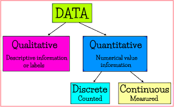

# Univariate Graphs

**Learning objectives:**

- Describes graphs for visualizing the distribution of a single categorical (e.g. race) or quantitative (e.g. income) variable


## Categorical vs. Quantitive Variables

- **Categorical (i.e. Qualitative) data** are descriptive and can be grouped into meaningful themes or categories. The distribution of a single categorical variable is typically plotted with a bar chart, a pie chart, or (less commonly) a tree map.

- **Quantitative data** are countable or measurable and can be analyzed using statistical analysis. The distribution of a single quantitative variable is typically plotted with a histogram, kernel density plot, or dot plot.

## Categorical vs. Quantitive Variables cont.


```{r, 03-01, echo=FALSE, dpi= 20}

```

## Marriage Dataset

- The Marriage dataset comes from the `mosiacData` package. 

- It is contains the marriage records of 98 individuals collected from a probate court in Mobile County, Alabama.

```{r 03-02, include=FALSE}
library(ggplot2)
library(dplyr)
data(Marriage, package = "mosaicData")

glimpse(Marriage)
```


## Bar Chart

A [bar chart](https://r-graph-gallery.com/barplot.html) is used to display the relationship between a numeric and a categorical variable. 

```{r 03-03}
# plot the distribution of race
ggplot(Marriage, aes(x = race)) + 
  geom_bar()
```


## Pie Chart

A [pie chart](https://r-graph-gallery.com/pie-plot.html) is a circle divided into sectors that each represent a proportion of the whole. 


```{r 03-04}
# create a basic ggplot2 pie chart
plotdata <- Marriage %>% 
    count(race) %>% 
    arrange(desc(race)) %>% 
    mutate(prop = round(n * 100 / sum(n), 1),
           lab.ypos = cumsum(prop) - 0.5  *prop)
  
  ggplot(plotdata, 
         aes(x = "", 
             y = prop, 
             fill = race)) +
    geom_bar(width = 1, 
             stat = "identity", 
             color = "black") +
    coord_polar("y", 
                start = 0, 
                direction = -1) +
    theme_void()

```

## Caveat: Pie charts


Pie charts are controversial in statistics. If your goal is to compare the frequency of categories, you are better off with bar charts (humans are better at judging the length of bars than the volume of pie slices). If your goal is compare each category with the the whole (e.g., what portion of participants are Hispanic compared to all participants), and the number of categories is small, then pie charts may work for you. It takes a bit more code to make an attractive pie chart in R.

## Tree map

- An alternative to a pie chart, a [tree map](https://r-graph-gallery.com/treemap.html) displays hierarchical data as a set of nested rectangles. 

- Unlike pie charts, tree maps can handle categorical variables that have many levels.

- Each group is represented by a rectangle, which area is proportional to its value.


## Tree map cont.

```{r 03-05}
library(treemapify)

# create a treemap of marriage officials
plotdata <- Marriage %>%
  count(officialTitle)

ggplot(plotdata, 
       aes(fill = officialTitle, 
           area = n)) +
  geom_treemap() + 
  labs(title = "Marriages by officiate")
```


## Histogram

A [histogram](https://r-graph-gallery.com/histogram.html) is used to study the distribution of a single quantitative variable. 

```{r 03-06, message=FALSE}
# plot the age distribution using a histogram
ggplot(Marriage, aes(x = age)) +
  geom_histogram() + 
  labs(title = "Participants by age",
       x = "Age")
```


## Kernel Density Plot

An alternative to a histogram, a [density plot](https://r-graph-gallery.com/density-plot.html) also shows the distribution of a single numeric variable.

```{r 03-07}
# Create a kernel density plot of age
ggplot(Marriage, aes(x = age)) +
  geom_density() + 
  labs(title = "Participants by age")
```


## Dot Chart

Another alternative to the histogram is the dot chart. 

```{r 03-08, message=FALSE}
# plot the age distribution using a dotplot
ggplot(Marriage, aes(x = age)) +
  geom_dotplot() + 
  labs(title = "Participants by age",
       y = "Proportion",
       x = "Age")
```

## Geom options

- `fill` fills color inside
- `color` controls the border color 
- `bins` controls the number of bins into which the numeric variable is divided
- `binwidth` controls the width of the bins 
- `bw` controls the degree of smoothness of density plot


## Resources

For more information about options within geoms, visit [https://ggplot2.tidyverse.org/reference/index.html](https://ggplot2.tidyverse.org/reference/index.html) 

Featured geoms:

- [`geom_bar`](https://ggplot2.tidyverse.org/reference/geom_bar.html)

- [`geom_histogram`](https://ggplot2.tidyverse.org/reference/geom_histogram.html)

- [`geom_density`](https://ggplot2.tidyverse.org/reference/geom_density.html)

- [`geom_dotplot`](https://ggplot2.tidyverse.org/reference/geom_dotplot.html)

- [`geom_treemap`](https://wilkox.org/treemapify/)

For more information about annotations, see [*ggplot2: Elegant Graphics for Data Analysis*](https://ggplot2-book.org/index.html) [Chapter 8: Annotations](https://ggplot2-book.org/annotations.html)

## Meeting Videos {-}

### Cohort 1 {-}

`r knitr::include_url("https://www.youtube.com/embed/URL")`

<details>
<summary> Meeting chat log </summary>

```
LOG
```
</details>
