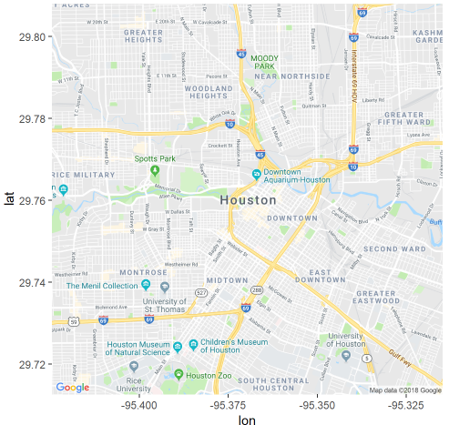
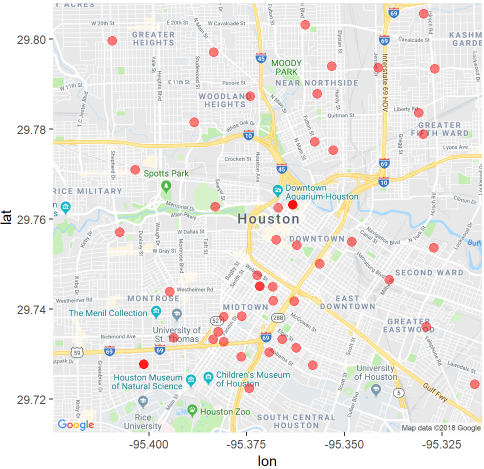
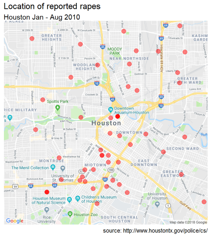
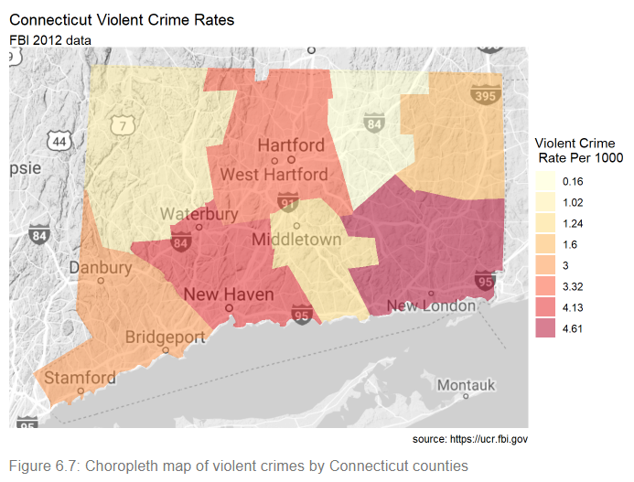

# Maps

**Learning objectives:**

- We are going to learn how to create dots density maps in R

- We are going to learn how to create a chloroplet map in R

## Introduction

- R provides a myriad of methods for creating both static and interactive maps containing statistical information.  We are going to focus on the use of **ggmap** and **choroplethr** package.


## Dot density maps

- Dot density maps use points on a map to explore spatial relationships.

- The Houston crime dataset contains the date, time, and address of six types of criminal offenses reported between January and August 2010.


```{r,warning=FALSE,message=FALSE}
library(ggmap)

# subset the data
library(dplyr)

rapes <- filter(crime, offense == "rape") %>%
  select(date, offense, address, lon, lat)

# view data
head(rapes)
```

- Find the center coordinates for Houston, TX

```{r,eval=FALSE}
# using geocode function returns 

houston_center <- geocode("Houston, TX")
```

- Get the background map image.

* Specify a zoom factor from 3 (continent) to 21 (building). The default is 10 (city).

* Specify a map type. Types include **terrain**, **terrain-background**, **satellite**, **roadmap**, **hybrid**, **watercolor**, and **toner**.


```{r,eval=FALSE}
# get Houston map

houston_map <- get_map(houston_center, 
                       zoom = 13, 
                       maptype = "roadmap")

ggmap(houston_map)
```



- Add crime locations to the map.

```{r,eval=FALSE}
# add incident locations
ggmap(houston_map, 
      base_layer = ggplot(data = rapes,
                          aes(x=lon, y = lat))) +
  geom_point(color = "red",
             size = 3,
             alpha = 0.5)
```



- Clean up the plot and add labels.

```{r,eval=FALSE}
# remove long and lat numbers and add titles
ggmap(houston_map, 
      base_layer = ggplot(aes(x=lon, y = lat), 
                          data = rapes)) +
  geom_point(color = "red",
             size = 3,
             alpha = 0.5) +
  theme_void() +
  labs(title = "Location of reported rapes",
       subtitle = "Houston Jan - Aug 2010",
       caption = "source: http://www.houstontx.gov/police/cs/")
```



[To learn more about ggmap, see ggmap: Spatial Visualization with ggplot2.](https://journal.r-project.org/archive/2013-1/kahle-wickham.pdf)


## Choropleth maps

Choropleth maps use color or shading on predefined areas to indicate average values of a numeric variable in that area.  We’ll use the choroplethr package to create maps that display information by country, and US county.

##  Data by country

- world map and color the countries by life expectancy using the 2007 gapminder data


```{r,warning=FALSE,message=FALSE}
# view the first 12 region names in country.map
data(country.map, package = "choroplethrMaps")

head(unique(country.map$region), 12)
```

```{r}
# prepare dataset
data(gapminder, package = "gapminder")

plotdata <- gapminder %>%
  filter(year == 2007) %>%
  rename(region = country,
         value = lifeExp) %>%
  mutate(region = tolower(region)) %>%
  mutate(region = recode(region,
                          "united states"    = "united states of america",
                          "congo, dem. rep." = "democratic republic of the congo",
                          "congo, rep."      = "republic of congo",
                          "korea, dem. rep." = "south korea",
                          "korea. rep."      = "north korea",
                          "tanzania"         = "united republic of tanzania",
                          "serbia"           = "republic of serbia",
                          "slovak republic"  = "slovakia",
                          "yemen, rep."      = "yemen"))

head(plotdata)
```

- Map

```{r,warning=FALSE,message=FALSE}
library(choroplethr)

country_choropleth(plotdata)
```

- choroplethr functions return ggplot2 graphs. Let’s make it a bit more attractive by modifying the code with additional ggplot2 functions.


```{r,warning=FALSE,message=FALSE}
country_choropleth(plotdata,
                   num_colors=9) +
  scale_fill_brewer(palette="YlOrRd") +
  labs(title = "Life expectancy by country",
       subtitle = "Gapminder 2007 data",
       caption = "source: https://www.gapminder.org",
       fill = "Years")
```

## Data by US County

```{r,warning=FALSE,message=FALSE}
library(ggplot2)
library(choroplethr)
library(dplyr)
```


```{r}
# enter violent crime rates by county
crimes_ct <- data.frame(
  county = c("fairfield", "hartford", 
             "litchfield", "middlesex", 
             "new haven", "new london", 
             "tolland", "windham"),
  value = c(3.00, 3.32, 
            1.02, 1.24, 
            4.13, 4.61, 
            0.16, 1.60)
)


crimes_ct
```


```{r,warning=FALSE,message=FALSE}
# obtain region codes for connecticut
data(county.regions, 
     package = "choroplethrMaps")


region <- county.regions %>%
  filter(state.name == "connecticut")


region
```

```{r}
# join crime data to region code data
plotdata <- inner_join(crimes_ct, 
                       region, 
                       by=c("county" = "county.name"))
plotdata
```


```{r,eval=FALSE}
# create choropleth map
county_choropleth(plotdata, 
                  state_zoom = "connecticut",
                  reference_map = TRUE,
                  num_colors = 8) +
  scale_fill_brewer(palette="YlOrRd") +
  labs(title = "Connecticut Violent Crime Rates",
       subtitle = "FBI 2012 data",
       caption = "source: https://ucr.fbi.gov",
       fill = "Violent Crime\n Rate Per 1000")
```



[See the choroplethr help for more details.](https://cran.r-project.org/web/packages/choroplethr/choroplethr.pdf)

[The tmap package provides another way of creating choropleth maps in R](https://cran.r-project.org/web/packages/tmap/vignettes/tmap-getstarted.html)

## Meeting Videos {-}

### Cohort 1 {-}

`r knitr::include_url("https://www.youtube.com/embed/URL")`

<details>
<summary> Meeting chat log </summary>

```
LOG
```
</details>
